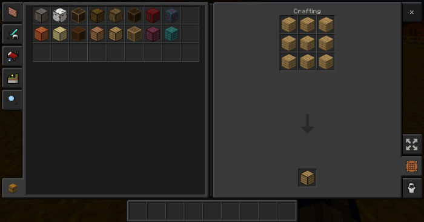
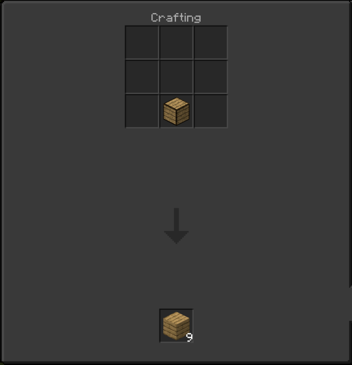

# Compressed Wood Addon


With this addon, anyone will be able to compress any wood into the 16 new blocks that allow for an easier form to carry.

This was inspired by the original mod in Minecraft: Java Edition called [Compressed Blocks Mod](https://www.curseforge.com/minecraft/mc-mods/compressed-blocks-mod). This was suggested by Pokededg on MCPEDL

There are the names of the compressed wood that is added in this addon:

* Compressed Acacia Planks
* Compressed Acacia Log
* Compressed Birch Planks
* Compressed Birch Log
* Compressed Dark Oak Planks
* Compressed Dark Oak Log
* Compressed Jungle Planks
* Compressed Jungle Log
* Compressed Oak Planks
* Compressed Oak Log 
* Compressed Spruce Planks
* Compressed Spruce Log
* Compressed Crimson Planks 
* Compressed Crimson Stem
* Compressed Warped Planks
* Compressed Warped Stem

To craft these new blocks, you just fill up the whole crafting table.



To uncraft these new blocks, you just place one anywhere on the crafting table and it goes back to the original block.



You can also use a command to bypass creating all these by hand. (# equals the type of wood) .

```
/give @s cw:cw_#
```

For more information visit [mcpedl.com](https://mcpedl.com/compressed-wood-addon/).
